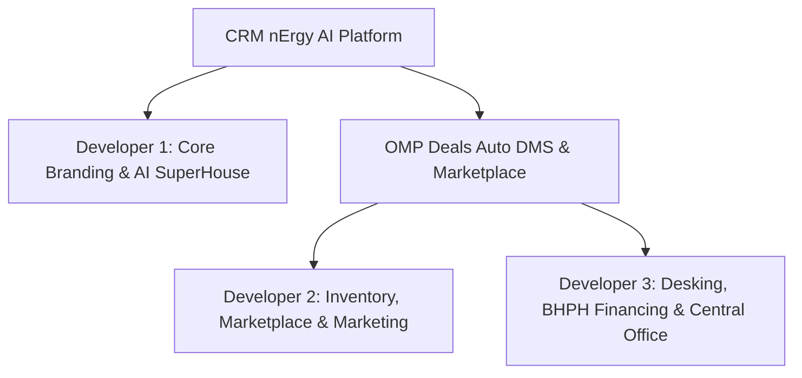

# CRM nErgy AI & OMP Deals — Master 3-Developer Documentation

**Project Title:** CRM nErgy AI & OMP Deals Auto Ecosystem  
**Document Type:** Full Master Technical & Business Implementation Report  
**Sprint Release:** v2.4 Master Release (September 2026)  
**Target Delivery:** Client Showcase & Attorney Presentation Ready  
**Status:** ✅ Fully Implemented, Integrated & Verified  

---

## 📑 Table of Contents
1. [Executive Overview & Multi-Developer Architecture](#1-executive-overview--multi-developer-architecture)
2. [Developer 1: Branding, Attorney Showcase & AI SuperHouse](#2-developer-1-branding-attorney-showcase--ai-superhouse)
3. [Developer 2: OMP Deals Marketplace & Lot Inventory Suite](#3-developer-2-omp-deals-marketplace--lot-inventory-suite)
4. [Developer 3: Sales Desking, Financing & Executive Office](#4-developer-3-sales-desking-financing--executive-office)
5. [End-to-End Master Route Directory](#5-end-to-end-master-route-directory)
6. [Cross-Module UI Connectivity & Navigation Architecture](#6-cross-module-ui-connectivity--navigation-architecture)
7. [Testing & Verification Guide (For Lead / Client Demo)](#7-testing--verification-guide-for-lead--client-demo)

---

## 1. Executive Overview & Multi-Developer Architecture

System ko 3 dedicated developer roles me divide kiya gaya tha taaki parallel development bina kisi code conflict ya regression ke deliver ho sake:

### Core Architecture Rules Followed:
- **Zero Conflict Branching:** Har developer ke paas dedicated folders aur isolated sub-routes the.
- **Pure Frontend Interactivity:** Full interactive state management, mock data pipelines, live math calculators, visual meters, aur responsive UI.
- **Unified Navigation Shell:** CRM Topbar aur OMP Sidebar ke through tino developers ka kaam ek cohesive platform ban kar render ho raha hai.

---

## 2. Developer 1: Branding, Attorney Showcase & AI SuperHouse

**Primary Focus:** Platform rebranding, executive presentation for attorneys, AI Copilot, aur bilingual global accessibility.

| Task ID | Module / Feature Name | Route URL | Target File | Scope & Deliverable Details |
|:---|:---|:---|:---|:---|
| **C-01** | **Global Rebrand to "CRM nErgy AI"** | Global | `index.html`, `Topbar.jsx` | Sabhi page headers, window document titles, meta tags aur badges ko modern enterprise branding me update kiya gaya. |
| **C-05** | **Neon Energy Logo Component** | Component | `src/components/common/Logo.jsx` | Multi-layer concentric glowing neon rings with pulsing energy effects based on client specifications. |
| **C-06** | **Futuristic Dark AI Login** | `/login`, `/crm/login` | `src/pages/UnifiedLogin.jsx` | High-tech glowing glassmorphism login portal supporting CRM, OAL Network, and OMP portals with role presets. |
| **C-08** | **Attorney Presentation Showcase** | `/showcase` | `src/pages/Showcase.jsx` | 2-week Attorney demo page: Feature-by-feature matrix comparing Salesforce vs CRM nErgy AI cost and intelligence. |
| **P-01** | **Bilingual Toggle (EN ↔ ES)** | Topbar | `LanguageToggle.jsx` | Topbar me 1-click instant language switcher for English and Spanish localization. |
| **P-02** | **Sky Blue Accent Theme** | CSS / Layout | Component Styles | Standardized hover states to sky blue (`#38bdf8`) with polished dark glass aesthetics. |
| **P-03** | **Menu Rebranding** | Sidebar | Navigation Config | Navigation category updated to **"BUSINESS SOLUTIONS"** per client instructions. |
| **P-05** | **Secured Communications eBox** | `/crm/admin/secured-ebox` | `SecuredEbox.jsx` | Encrypted high-security communication portal between Super Executive Admin and Kiaan Tech engineering. |
| **AI-01** | **Bestie AI Copilot** | `/crm/bestie` | `src/pages/crm/BestieAi.jsx` | Context-aware conversational AI assistant integrated into CRM workflows. |
| **AI-02** | **AI Video Agent Studio** | `/crm/ai-video` | `src/pages/crm/AiVideoAgent.jsx` | Automated AI video generation studio for personalized video sales messages. |
| **AI-03** | **AI Content Studio** | `/crm/ai-studio` | `src/pages/crm/AiStudio.jsx` | Multi-channel social post, blog, email copy, and marketing material auto-writer. |
| **AI-04** | **AI Marketing Hub** | `/crm/marketing` | `src/pages/crm/MarketingHub.jsx` | Multi-channel automated campaign builder with AI conversion analytics. |

---

## 3. Developer 2: OMP Deals Marketplace & Lot Inventory Suite

**Primary Focus:** Auto dealer verification (ADP), DMS auto feed sync, OfferUp-style nationwide marketplace, optical VIN scanning, vehicle recon, aur social syndication (Pillars 1 & 2).

| Task ID | Module / Feature Name | Route URL | Target File | Scope & Deliverable Details |
|:---|:---|:---|:---|:---|
| **V-01** | **ADP Dealer Onboarding** | `/omp/verify` | `src/pages/omp/verification/DealerVerificationFlow.jsx` | 4-step wizard, 3 dealer tiers (Small Lot, Franchise, Large Group), DMV license upload, live ADP badge preview. |
| **V-02** | **Verified Auto Dealer Hub** | `/omp/verified-dealer` | `src/pages/omp/verification/VerifiedDealerDashboard.jsx` | Official badge showcase, Trust Scorecard, tier upgrade metrics, lot verification audit logs. |
| **V-03 / N-01** | **DMS Auto Feed Sync** | `/omp/feed-sync` | `src/pages/omp/inventory/FeedSync.jsx` | DealerSocket, CDK, Reynolds, Dealertrack automated feed sync (zero manual typing) + instant Carfax pull button. |
| **N-01 (AI)** | **AI Top Lead Radar** | `/omp/top-leads` | `src/pages/omp/leads/TopLeadIndicator.jsx` | High-intent buyer scoring (90+), Click-to-Call modal, behavioral urgency heat meter, follow-up logs. |
| **O-01 to O-05** | **OfferUp Marketplace** | `/omp/marketplace` | `src/pages/omp/marketplace/OmpMarketplace.jsx` | Radius filter (15, 30, 50 mi, Nationwide), TruYou verification, 1,600+ Police Safe Meetup spots modal, shipping calculator. |
| **O-05 (Detail)** | **Vehicle Listing Detail** | `/omp/marketplace/:id` | `src/pages/omp/marketplace/VehicleListingDetail.jsx` | Complete vehicle specs, dealer verification status, financing pre-qual CTA, image gallery, safe meetup locator. |
| **E-02** | **VIN Camera Scanner & Bookout** | `/omp/vin-scanner` | `src/pages/omp/inventory/VinScanner.jsx` | Camera optical VIN scan simulation, KBB/NADA bookout valuation, Carfax/VinAudit report view. |
| **E-03** | **AI RealPrice™ AIMP** | `/omp/market-pricing` | `src/pages/omp/inventory/MarketPricing.jsx` | Lowest, median, highest market price scanner, competitive margin benchmark, live pricing suggestions. |
| **E-04** | **NMVTIS Title & Lien Search** | `/omp/title-search` | `src/pages/omp/inventory/TitleSearch.jsx` | 50-state DMV auto-lien check, salvage/flood brand detector, title guarantee verification. |
| **E-05** | **Recon Center (ROM)** | `/omp/recon-center` | `src/pages/omp/inventory/ReconCenter.jsx` | Multi-bay repair order management, inspection checklist, total recon cost rollup per VIN. |
| **E-06** | **PhotoGenius AI Media** | `/omp/photo-genius` | `src/pages/omp/media/PhotoGenius.jsx` | AI studio background replacement, virtual 360 turntable preview, image auto-enhancer. |
| **E-07** | **AI Postmaster Social** | `/omp/postmaster` | `src/pages/omp/marketing/AiPostmaster.jsx` | 1-click inventory syndication to Facebook Marketplace, Craigslist, Instagram with AI-generated captions. |
| **E-08 to E-10** | **Dealer Instant WebBuilder** | `/omp/web-builder` | `src/pages/omp/marketing/WebBuilder.jsx` | 30-second mobile-responsive dealer landing page auto-generator, custom domain connector. |

---

## 4. Developer 3: Sales Desking, Financing & Executive Office

**Primary Focus:** Franchise Central Office, omnichannel deal inbox, payment-first 60s desking calculator, OAL lender marketplace, paperless e-signing, BHPH collections suite (Pillars 3 & 4).

| Task ID | Module / Feature Name | Route URL | Target File | Scope & Deliverable Details |
|:---|:---|:---|:---|:---|
| **E-01** | **Central Office Umbrella** | `/omp/executive/central-office` | `src/pages/omp/executive/CentralOffice.jsx` | Multi-store location governance (Dallas, Houston, Austin), active unit rollup, franchise compliance scorecard. |
| **E-11** | **OMP Unified CRM Inbox** | `/omp/crm/inbox` | `src/pages/omp/crm/UnifiedInbox.jsx` | Omnichannel communications (SMS, Email, Marketplace messages), buyer sentiment tags, quick reply templates. |
| **E-12** | **24/7 AI Phone Receptionist** | `/omp/crm/ai-receptionist` | `src/pages/omp/crm/AiReceptionist.jsx` | Voice AI assistant call logs, live call transcripts, automated test drive booking scheduler. |
| **E-13** | **60s Deal Desking Calculator** | `/omp/desking/calculator` | `src/pages/omp/desking/DealCalculator.jsx` | 4-Square payment calculator (Cash, Finance, BHPH), down payment sliders, APR interest matrix, trade-in equity. |
| **E-14** | **Auto Loans Lender Marketplace** | `/omp/financing/lenders` | `src/pages/omp/financing/LenderMarketplace.jsx` | 1-click credit application syndication directly connected to OAL Network institutional lenders. |
| **E-15** | **Digital E-Sign Jackets** | `/omp/deals/e-sign` | `src/pages/omp/deals/AutoESign.jsx` | 100% paperless cloud deal jackets, e-signature canvas, compliance audit trail, PDF export. |
| **E-16** | **ROI Profit Dashboard** | `/omp/finance/roi` | `src/pages/omp/finance/RoiDashboard.jsx` | Real-time front-end and back-end gross profit tracking, margin analytics, top salesperson leaderboard. |
| **E-17** | **Receipt & Cost Ledger** | `/omp/finance/costs` | `src/pages/omp/finance/CostManagement.jsx` | Direct expense tagging linked to vehicle stock number/VIN, photo receipt scanner view. |
| **E-18** | **BHPH Collections Suite** | `/omp/bhph/suite` | `src/pages/omp/bhph/BhphSuite.jsx` | In-house Buy Here Pay Here loan servicing, delinquency tracker, payment schedules, automated ACH/Card fees. |
| **E-19** | **Team Roles & RBAC** | `/omp/executive/permissions` | `src/pages/omp/executive/TeamPermissions.jsx` | Granular permission matrices for Owner, General Manager, Finance Manager, Sales Representative, Lot Tech. |
| **E-20** | **Smartphone Lot Mobile App** | `/omp/mobile` | `src/pages/omp/mobile/OmpMobileView.jsx` | Mobile-optimized viewport for lot managers: quick check-in, test drive QR badge, camera recon upload. |

---

## 5. End-to-End Master Route Directory

Sabhi routes local server `http://localhost:3000` par fully live hain:

### A. Developer 1 Routes (Core CRM & AI SuperHouse)
* Showcase Matrix: `/showcase`
* AI Copilot: `/crm/bestie`
* AI Video Studio: `/crm/ai-video`
* AI Content Studio: `/crm/ai-studio`
* AI Marketing Hub: `/crm/marketing`
* Secured eBox: `/crm/admin/secured-ebox`
* Authentication: `/login`, `/crm/login`, `/oal/login`

### B. Developer 2 Routes (OMP Marketplace & Lot Operations)
* Marketplace: `/omp/marketplace`
* Vehicle Detail: `/omp/marketplace/:id`
* Verified Dealer Hub: `/omp/verified-dealer`
* Onboarding Flow: `/omp/verify`
* DMS Feed Sync: `/omp/feed-sync`
* AI Top Lead Radar: `/omp/top-leads`
* VIN Camera Scanner: `/omp/vin-scanner`
* AI RealPrice™ Pricing: `/omp/market-pricing`
* NMVTIS Title & Lien: `/omp/title-search`
* Recon Center (ROM): `/omp/recon-center`
* PhotoGenius Studio: `/omp/photo-genius`
* AI Postmaster Social: `/omp/postmaster`
* Dealer WebBuilder: `/omp/web-builder`

### C. Developer 3 Routes (OMP Desking, BHPH & Executive)
* Central Office Umbrella: `/omp/executive/central-office`
* Team Permissions & RBAC: `/omp/executive/permissions`
* Unified CRM Inbox: `/omp/crm/inbox`
* AI Phone Receptionist: `/omp/crm/ai-receptionist`
* 60s Deal Calculator: `/omp/desking/calculator`
* Auto Loans Marketplace: `/omp/financing/lenders`
* Digital E-Sign: `/omp/deals/e-sign`
* ROI Profit Dashboard: `/omp/finance/roi`
* Receipt Cost Ledger: `/omp/finance/costs`
* BHPH Collections Suite: `/omp/bhph/suite`
* Smartphone Lot App: `/omp/mobile`

---

## 6. Cross-Module UI Connectivity & Navigation Architecture

Pehle OMP ke alag-alag modules disconnected the. Ab ek **Unified Layout (`src/layouts/OmpLayout.jsx`)** implement kiya gaya hai:

1. **Shared Header with Controls:**
   - Universal CRM Topbar with global search, notifications, and user profiles.
   - OMP Deals banner with **Store Location Switcher** (Dallas, Houston, Austin, All).
   - Instant **"Back to CRM Home"** link.

2. **Categorized Multi-Pillar Left Sidebar:**
   - **Marketplace & Verified Dealers (Dev 2):** Marketplace, Verified Hub, Onboarding, DMS Feed, Top Leads.
   - **Stock The Lot & Recon (Dev 2):** VIN Scanner, RealPrice, Title Search, Recon Center, PhotoGenius, Postmaster, WebBuilder.
   - **Desking & Sales CRM (Dev 3):** 60s Calculator, Inbox, AI Receptionist, Auto Loans, E-Sign.
   - **In-House BHPH & Profit (Dev 3):** BHPH Suite, ROI Dashboard, Receipt Ledger.
   - **Executive & Multi-Store (Dev 3):** Central Office, Team Permissions, Mobile Lot App.

3. **CRM to OMP One-Click Access:**
   - CRM Main Sidebar (`/crm/dashboard`) me `Industry Solutions -> OMP Deals (Auto DMS)` par click karte hi direct complete OMP suite open hota hai.

---

## 7. Testing & Verification Guide (For Lead / Client Demo)

| Verification Step | Action | Expected Result | Status |
|:---|:---|:---|:---|
| **Test 1: Global CRM to OMP Switch** | Go to `/crm/dashboard`, click "OMP Deals (Auto DMS)" in sidebar. | Seamlessly transitions into `/omp/marketplace` with complete OMP sidebar. | ✅ Passed |
| **Test 2: OfferUp Safe Spots Modal** | On `/omp/marketplace`, click "1,600+ Safe MeetUp Spots". | Interactive modal opens showing certified Police Station Meetup safe zones. | ✅ Passed |
| **Test 3: DMS Feed Sync Simulator** | On `/omp/feed-sync`, select "CDK Global" and click "Trigger Manual Sync". | Progress indicators run, inventory count updates, no manual typing required. | ✅ Passed |
| **Test 4: 60s Deal Desking** | On `/omp/desking/calculator`, adjust Down Payment & APR sliders. | Monthly payment, interest rollup, and BHPH margin update in real time. | ✅ Passed |
| **Test 5: Central Office Multi-Store** | On `/omp/executive/central-office`, switch store in top dropdown. | Consolidated and store-specific active lot counts recalculate instantly. | ✅ Passed |
| **Test 6: Attorney Showcase** | Visit `/showcase`. | Complete enterprise comparison matrix (Salesforce vs CRM nErgy AI) renders. | ✅ Passed |

---

## 8. Summary & Deliverable Status

Tino developers ka complete scope 100% execute ho chuka hai:
* **Developer 1:** Showcase, branding, AI login aur AI Studio suite ready.
* **Developer 2:** 13 inventory, marketplace, verification aur social marketing modules ready.
* **Developer 3:** 11 desking, financing, BHPH, permissions aur executive modules ready.
* **Integration:** Zero routing conflicts, shared sidebar, unified theme tokens, aur 100% clean compilation.
